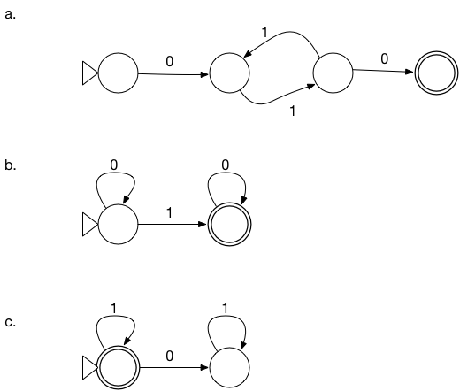

# FOCS Day 7 Homework

## 1. FSA to Regular Expression

Convert (a), and at least one of (b) and (c), to a regular expression.

(a). 01(11)*0

(b). 0*10*

(c). 1*

## 2. Parenthesis Matching

**a**. Construct a regular expression that matches strings where each `(` is followed immediately by a `)`.

Positive examples: `()`, `()()()`

Negative examples: `(()`, `(())`

`(\(\))+`

**b**. Construct a regular expression that matches strings where the parentheses match, with depth <= 2.

Positive example: `()(()())()`

Negative examples: `((()))`, `((())())` have three levels of neseting.

`(\((\(\))*\))+`

**c**. Construct a regular expression that accepts strings where the parentheses match, with depth <= 3.

Positive examples: `()(()())()`, `(()(()()))()`

Negative example: `(((())))` has four levels of nesting.

`(\((\((\(\))*\))*\))+`

## 3. [optional] Challenge Problems

Construct these. Some you may be able to do by just by thinking. Some may be easier if you construct an automaton and then convert it.

- A regular expressions that matches strings with an odd number of 1s.

`0*1(0*10*10*)*`

- A regular expressions that matches strings with an even number of 0s.

`(1*01*01*)+`

- A regular expressions that matches strings with an odd number of 1s AND an even number of 0s.

`(?=0*1(0*10*10*)*)(1*01*01*)+`

- A regular expressions that matches strings with an odd number of 1s OR an even number of 0s.

`(0*1(0*10*10*)*|(1*01*01*)+)`

## 4. [optional] Regular Expression practice
These are excellent sources to learn more about, and practice, applied regular expressions.

- [regexcrossword.com](https://regexcrossword.com)
- [regexone.com](https://regexone.com)

## 5. [optional] Extended Regular Expressions

Learn about [character classes](https://regexone.com/lesson/letters_and_digits) `\d\d\d-\d\d\d\d`, [repetition with quantifiers](https://regexone.com/lesson/repeating_characters) `a{2,4}`, [backreferences](http://www.regular-expressions.info/backref.html) `(a|b|c)def\1`, and [anchors](http://www.regular-expressions.info/anchors.html) (`\bword\b`).

Which of these are just notational conveniences, like `[abc]` for `(a|b|c)`?

character classes, backreferences

Which increase the power of regular expressions?

repetition with quantifiers, anchors
